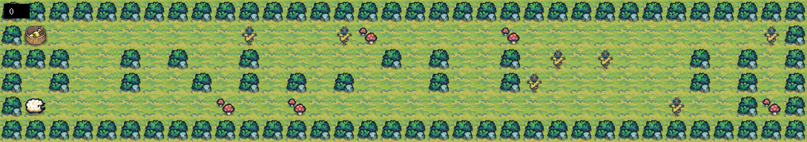
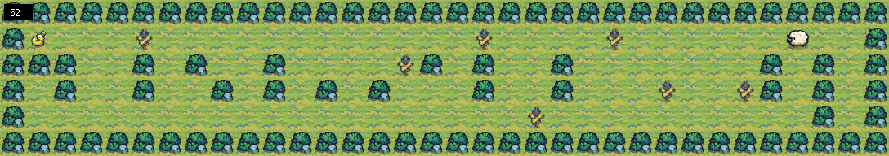

# so_long

The **so_long** project is a 2D game where the player navigates through a map to collect an item (e.g., a coin) while avoiding obstacles. The goal is to practice programming skills such as handling user input, managing graphical elements, and implementing basic game mechanics.

## Features

- **Player movement**: Use arrow keys to navigate through the map.
- **Map design**: The game map consists of walls, paths, and collectible items.
- **MiniLibX**: The project uses the MiniLibX library for graphics and window management.
- **Game mechanics**: Collect items and reach the exit to win the game.

## Requirements

- MiniLibX is included in the project and is compatible with **Linux** systems.

## Installation

To compile and run the project:

```bash
git clone https://github.com/YourUsername/so_long.git
cd so_long
make
./so_long maps/map.ber
```

To play the game, use the WASD keys to move the player:

```
W: Move up
A: Move left
S: Move down
D: Move right
```

## Screenshots



